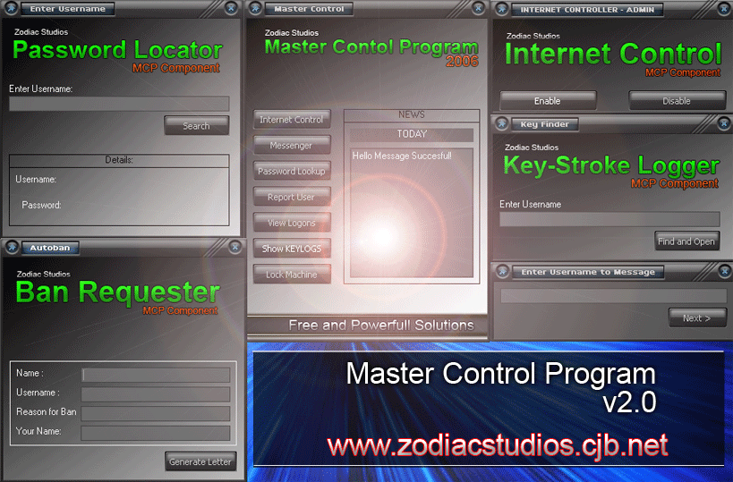



## Master Control Program v2\.0

### Description

General Network Management system, can log keystrokes, recall usernames and passwords, and control internet. Some other functions have been incuded also.
 
### More Info
 
MUST BE COMPILED TO RUN PROPERELY!

You can download the MCP compiled from www.freewebs.com/zodiacstudios/MCP.zip

             |
---                |---
**Submitted On**   |2006-03-12 09:51:42
**By**             |[Peter Smith](https://github.com/Planet-Source-Code/PSCIndex/blob/master/ByAuthor/peter-smith.md)
**Level**          |Intermediate
**User Rating**    |4.8 (24 globes from 5 users)
**Compatibility**  |VB 5\.0, VB 6\.0
**Category**       |[Complete Applications](https://github.com/Planet-Source-Code/PSCIndex/blob/master/ByCategory/complete-applications__1-27.md)
**World**          |[Visual Basic](https://github.com/Planet-Source-Code/PSCIndex/blob/master/ByWorld/visual-basic.md)
**Archive File**   |[Master\_Con1979913132006\.zip](https://github.com/Planet-Source-Code/peter-smith-master-control-program-v2-0__1-64648/archive/master.zip)

